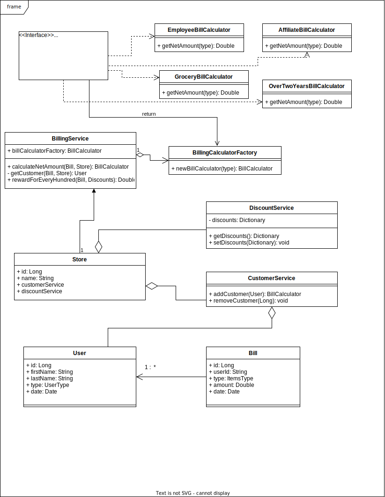

# Net Billing



# How to run the tests
Clone the repository and run the command ```mvn clean install```, this will first clean the project by running the ``` clean ``` lifecyccle
and then build the project.

To run all the unit tests, run the command ```mvn test```
The project is using Junit5 dependency for the tests and Jacoco for code coverage.


# Generate Code Coverage
To generate the coverage for the project, run ```mvn clean verify```,
this will run all the preceeding Maven lifecycles and also generate code coverage in the ``` target/site/jacoco ``` folder.

There is an ```index.html``` file in this folder. It can be opened in any browser to properly view the page information.
